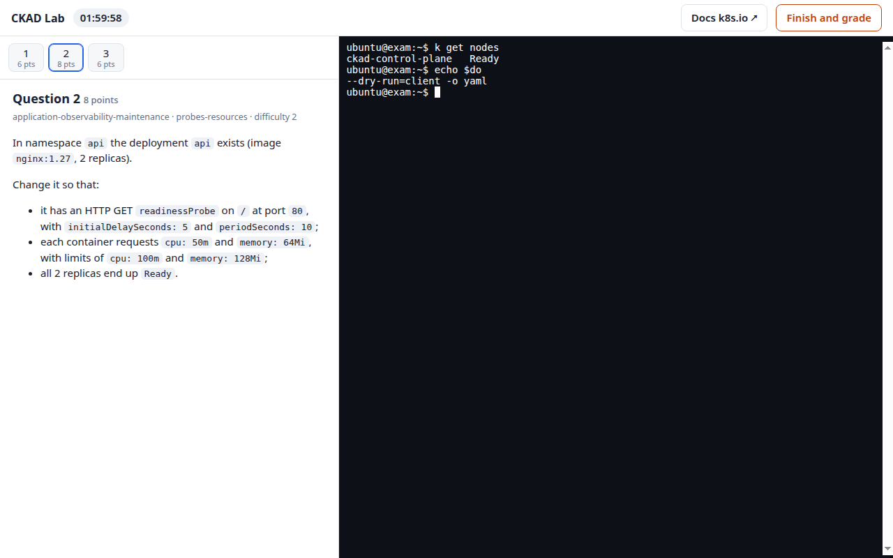
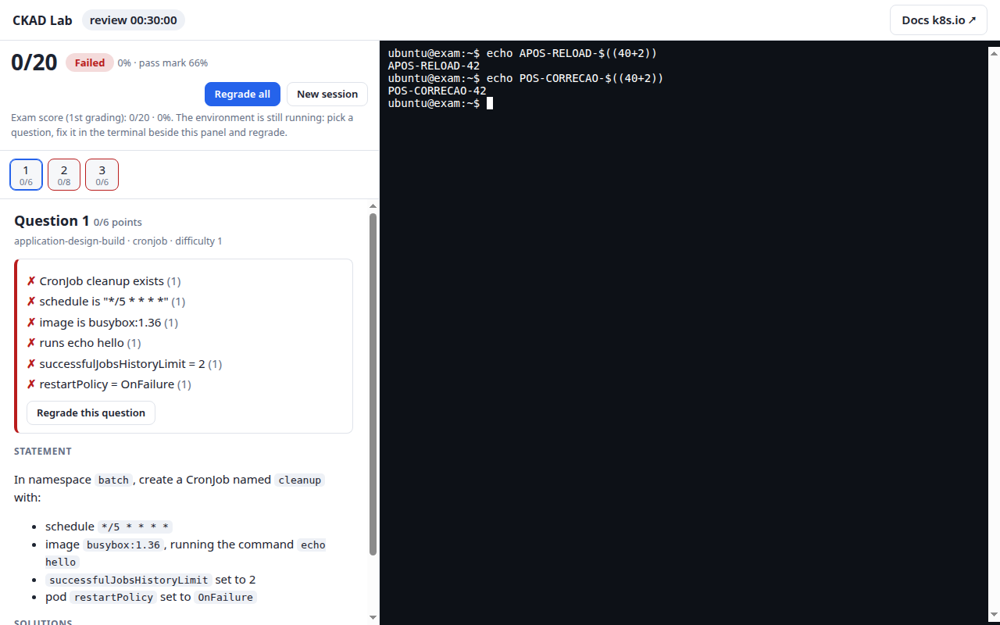
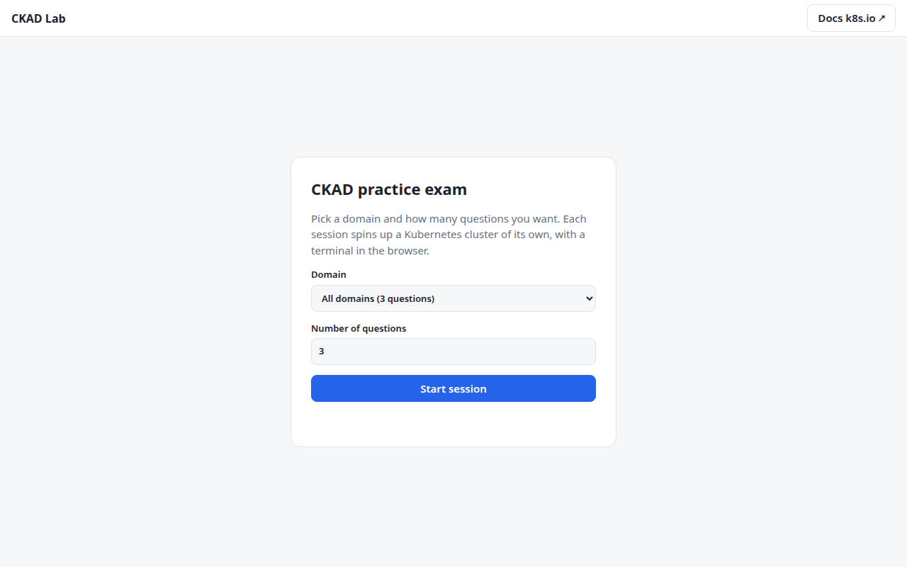

# ckad-lab

**A hands-on CKAD simulator.** Pick a domain, get a real Kubernetes cluster of your own, solve
questions in a terminal running right in the browser, get graded — then go back, fix what you
missed, and grade it again, without losing the cluster.

<p>
  
  
  
  
</p>

<p align="center">
  
  
</p>

## Contents

- [Why](#why)
- [Quick start](#quick-start)
- [How a session works](#how-a-session-works)
- [Architecture](#architecture)
- [Question format](#question-format)
- [Validating questions](#validating-questions)
- [Tests](#tests)
- [Deploying to a server](#deploying-to-a-server)
- [Security](#security)
- [Repository layout](#repository-layout)
- [Known limitations and roadmap](#known-limitations-and-roadmap)

## Why

Most CKAD practice resources are either static question lists (no cluster, no real checking) or
killer.sh-style one-shot simulators (great exam simulation, but the environment disappears the
moment you're graded — no going back to see *why* a check failed and fix it). This project aims
for the middle ground: a disposable-but-revisitable cluster, auto-generated variation so the same
question never looks identical twice, and a review mode that keeps the environment alive so
grading is a learning loop, not a dead end.

## Quick start

```bash
git clone git@github.com:kgbunshin/k8s4pass.git ckad-lab && cd ckad-lab
./run.sh          # http://127.0.0.1:8000  (Ctrl+C stops it and tears down every cluster)
```

Requirements: `docker`, `kind`, `kubectl`, and `python3` with `venv`. `run.sh` creates the
virtualenv and builds the student-shell image on its first run.

<p align="center"></p>

## How a session works

```mermaid
sequenceDiagram
    participant B as Browser
    participant A as FastAPI app
    participant K as kind cluster (per session)
    B->>A: POST /api/sessions {domain, count}
    A-->>B: 201 provisioning
    A->>K: kind create cluster + docker run (student shell)
    A->>K: run each question's Setup script
    Note over A,K: ~40s, then status: ready — 2h clock starts
    B->>A: WS /ws/terminal/{id}  (xterm.js ⇄ docker exec -it)
    B->>A: POST /api/sessions/{id}/finish
    A->>K: run every Check script (host-side, out of student reach)
    A-->>B: score + solutions revealed
    Note over A,K: environment STAYS ALIVE — review window (30 min default)
    B->>A: POST /api/sessions/{id}/regrade {question?}
    A->>K: re-run Check(s) for that question, or all
    A-->>B: updated score; history keeps the original exam score
    Note over A,K: window ends (or "New session") → cluster torn down
```

1. `POST /api/sessions` draws N questions from a domain. Every `{{var}}` in the question is
   drawn per session (different namespace names, ports, replica counts, ...) and namespaces are
   checked against each other so two questions in the same session never collide.
2. In the background: a `kind` cluster (`ckad-s-<id>`) comes up, a locked-down shell container
   (`ckad-sh-<id>`) joins its network, and each question's `Setup` script runs. The 2-hour exam
   clock starts once that's done (~40s).
3. The browser opens a WebSocket that bridges an xterm.js terminal to `docker exec -it` inside
   the shell container. That shell **only ever sees this session's own cluster** — no Docker
   socket, no Linux capabilities, capped at 256 MB / 0.5 CPU.
4. **Finish and grade** (or the clock running out — the reaper grades automatically, ~1 minute
   after time is up) runs every `Check` script on the **host**, out of the student's reach, and
   only then reveals the checks and the reference solutions. Pass mark: 66%, same as the real exam.
5. **Review — go back and fix it.** The environment doesn't disappear at that point: it stays
   alive for `REVIEW_MINUTES` (30 by default). The result sits right beside the *same* terminal;
   clicking a question shows its ✓/✗ checks, the statement, and the solutions, and **Regrade**
   re-runs the checks for one question or for all of them. The score that counts as *the exam* is
   always the first grading — later regrades are logged in a small history
   (`62% → 100%`) so studying doesn't quietly overwrite the real result. Each regrade renews the
   window. A finished-but-still-alive session still counts toward `MAX_SESSIONS`, so **New
   session** exists to free it immediately.
6. When the review window ends (or you start a new session), the cluster and shell container are
   torn down and the result becomes read-only. On startup the server also sweeps up anything a
   previous, uncleanly-stopped run left behind — session state lives in memory only.

## Architecture

```
Browser  ── HTTP/WS ──▶  FastAPI (app/main.py)
                              │
                    app/sessions.py — Manager
                    (provision · grade · regrade · reap · teardown)
                              │
              ┌───────────────┴────────────────┐
              ▼                                 ▼
      kind cluster (per session)      shell container (per session)
      ckad-s-<id>                     ckad-sh-<id>, on the `kind` network
      created/deleted via `kind`      docker exec -it ⇄ WebSocket (app/terminal.py)
                                       no docker socket, no caps, 256 MB / 0.5 CPU
```

- **`app/main.py`** — the REST API, the `/ws/terminal/{id}` WebSocket, and static files. Rejects
  cross-origin writes and WebSocket connections (the app has no auth of its own; `Origin` is the
  only thing standing between a random web page and a student's shell).
- **`app/sessions.py`** — the `Manager`: provisioning, grading, regrading, the reaper (expiry,
  review-window teardown, orphan cleanup on startup), all under per-session locks.
- **`app/terminal.py`** — a PTY-backed bridge between the WebSocket and `docker exec -it`, with
  live resize (`SIGWINCH`).
- **`app/static/`** — the front end: one page (`index.html`), one script (`app.js`, no build
  step, no framework), xterm.js vendored locally so there's no runtime CDN dependency.
- **`tools/qlib.py`** — parses, lints, and renders question Markdown files (variable substitution
  is a per-session, seeded random draw — deterministic given the same seed, so a session can be
  replayed exactly).
- **`tools/validate.py`** — proves a question actually works (see [Validating
  questions](#validating-questions)) against a disposable test cluster it never confuses with
  your real one.

## Question format

A `.md` file with YAML front-matter and `##` sections. `questions/_template.md` is the model to
copy.

| Section | Content |
|---|---|
| front-matter | `id` (= file name), `domain`, `topic`, `difficulty` (1–3), `points`, `namespaces`, `vars` (optional), `check_timeout` (optional) |
| `## Statement` | the task text, in Markdown (paragraphs, lists, `code`, ` ``` ` blocks) |
| `## Setup` | a bash block that prepares the starting state |
| `## Check` | one line per check: `points\|description\|command` (exit 0 = correct) |
| `## Solution: name` | a bash block that solves it — **at least 2 differently-shaped solutions** |

- **`vars`** are drawn once per session (`{{ns}}`, `{{port}}`, ...) — variation without an LLM.
- **`namespaces`** lists exactly what the validator is allowed to delete between runs.
  `default` and any `kube-*` namespace are refused outright.
- **Checks** verify the *outcome* (state or behavior), never the way the student got there, and
  are retried for up to `check_timeout` seconds because cluster state (a rollout, a probe) often
  converges with a short delay.
- Two differently-worded `Solution`s that both pass the same `Check` are the cheapest proof that
  the check isn't brittle or accidentally checking the solution's shape instead of the outcome.
- A check that already passes before the student touches anything hands out free points — the
  validator warns (but doesn't fail) if **every** check passes unsolved.

The bank currently has **20 questions across all 5 CKAD domains** — CronJobs, multi-container
pods, PVCs, Jobs, rolling updates & Kustomize, probes & resources, logs, troubleshooting, CRDs,
RBAC, ResourceQuotas/LimitRanges, SecurityContexts, Services, EndpointSlices, Ingress, and
NetworkPolicy.

## Validating questions

```bash
python3 tools/validate.py --lint-only --strict   # format only, no cluster needed

tools/cluster.sh up                               # spins up kind cluster 'ckad-val' (~1 min)
python3 tools/validate.py                         # setup → checker must fail → solution → checker must pass
python3 tools/validate.py --seeds 3 questions/application-deployment
python3 tools/validate.py --report report.md      # writes a markdown report (handy as a PR body)
tools/cluster.sh down
```

A question passes when, left unsolved, the checker does **not** award full marks, and **every**
listed solution, applied to a fresh copy of the environment, **does**. The validator refuses to
run against anything but a `kind-*`/`k3d-*` context on localhost, never touches the kubectl
context you currently have active, and executes every script through a throwaway,
single-context kubeconfig — a hostile question script cannot reach any cluster but its own
disposable test copy.

## Tests

```bash
.venv/bin/python tests/e2e.py         # ~2 min · API, origin defenses, terminal, grading, review + regrade, cleanup
.venv/bin/python tests/ui_smoke.py    # ~2 min · the real front end, driven in its own headless Chrome
.venv/bin/python tests/lifecycle.py   # ~3 min · automatic expiry, the review window, orphan recovery
```

All three spin up real `kind` clusters. `e2e` and `ui_smoke` expect a server already running at
`127.0.0.1:8000`; `lifecycle` starts (and stops) its own on `:8001` — don't run it next to
another live server, since its startup sweep deletes every `ckad-s-*` cluster it finds.

## Deploying to a server

`ansible/` has a two-phase playbook that turns a bare Debian 13 box into a hardened host for
this app: SSH locked to key-only login for one admin account, ufw + fail2ban, **rootless Docker**
for the whole app (so escaping a student's privileged kind node lands in an unprivileged user
namespace, not on the host as root), an egress filter so the app and every student pod can only
reach the internet on 80/443, and nginx in front with basic auth and rate limiting. Full
walkthrough, threat model, and what it looks like on the wire: **[`ansible/README.md`](ansible/README.md)**.

## Security

This is what's implemented **today** — read it before pointing it at strangers.

- **No login of its own.** The 64-bit session id is the only secret the web app itself has. The
  `ansible/` deployment adds a shared HTTP basic-auth password in front of it; per-student
  accounts and quotas are still on the roadmap.
- **`Origin` is checked** on every state-changing HTTP request and on the terminal WebSocket —
  without it, any page a student had open in another tab could hijack their session's shell
  (cross-site WebSocket hijacking), even without knowing the session id.
- **Grading happens on the host**, never inside the student's shell — checks and solutions are
  invisible until a session is finished.
- **The student shell is boxed in**: no Docker socket, no Linux capabilities, 256 MB / 0.5 CPU,
  and it can only reach its own session's cluster.
- **kind nodes are still privileged containers**, though. A student who gets a privileged pod
  running on their own cluster can, in principle, escape to whatever is hosting the Docker
  daemon. Locally that's your laptop — fine for you and friends. On the hardened VPS deploy,
  Docker runs **rootless** specifically to blunt that: the daemon (and everything it runs) is an
  unprivileged Linux user, not root, so an escape lands there instead. For strangers at scale,
  that's still not as strong as a VM or Kata/Firecracker per session.
- **A finished server-side reaper** enforces session TTLs and the review-window teardown even if
  a browser tab is closed mid-exam; **on startup** the server deletes any `ckad-s-*` cluster left
  behind by an unclean shutdown — never run two instances against the same Docker daemon.

## Repository layout

```
questions/<domain>/<id>.md   the question bank (one file each); _template.md is the model
tools/qlib.py                question parser, lint, and seeded variable substitution
tools/validate.py            proves questions against a disposable test cluster
tools/cluster.sh             brings the validator's kind cluster up/down
app/main.py                  REST API + terminal WebSocket + static files
app/sessions.py              session lifecycle: provision, grade, regrade, reap, teardown
app/terminal.py              WebSocket ⇄ `docker exec -it` bridge over a PTY
app/static/                  the front end (index.html, app.js, style.css, vendored xterm.js)
app/shell/                   the student shell image (kubectl, vim, tmux, jq, the `k` alias)
tests/                       e2e.py, ui_smoke.py, lifecycle.py
ansible/                     hardened-VPS deployment playbook (see ansible/README.md)
docs/screenshots/            the images in this README
```

## Known limitations and roadmap

- Session state lives in memory only — restarting the server ends every active session.
- Images (`busybox`, `nginx`) are pulled from Docker Hub fresh on every new cluster: slow, and
  subject to Docker Hub's rate limits. Preloading with `kind load docker-image` would help.
- The shell has no `helm` (the exam covers Helm/Kustomize; `kubectl kustomize` is built in, plain
  `kubectl apply -k`).
- NetworkPolicy questions only check the object's spec — kind's default CNI doesn't necessarily
  enforce policies, so "traffic is actually blocked" isn't something the validator can prove.
- Automatic grading on timeout lands up to ~1 minute after the deadline (reaper polling interval
  plus grading time) — noticeable, not exam-accurate to the second.
- **Next up:** `tools/generate.py` — an LLM-assisted question generator (a local Ollama model is
  the leading candidate) whose output is only ever accepted after passing the exact same
  `validate.py` gate real questions do, most likely wired through a scheduled job that opens a
  PR with the validation report rather than writing straight to the bank. Beyond that: real
  per-student authentication and stronger per-session isolation for the public deployment.
